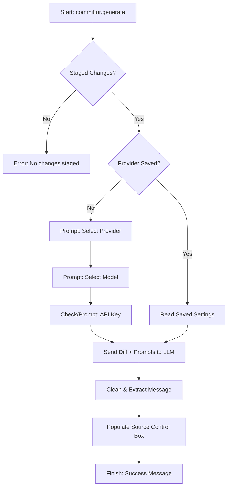
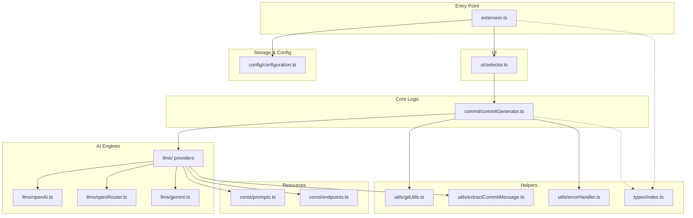

<p align="center">
  
</p>

# Committor: AI that writes your Git commits

[](https://marketplace.visualstudio.com/items?itemName=ManojBelbase.committor)
[](https://open-vsx.org/extension/manojbelbase/committor)
[](https://marketplace.visualstudio.com/items?itemName=ManojBelbase.committor)

**Committor** is a powerful VS Code extension that generates meaningful, conventional commit messages instantly from your staged changes using state-of-the-art AI models.

[**Get it on the VS Code Marketplace**](https://marketplace.visualstudio.com/items?itemName=ManojBelbase.committor) | [**Get it on Open VSX**](https://open-vsx.org/extension/manojbelbase/committor)

---

## Features

- **Multi-Provider Support**: Switch between OpenAI, Google Gemini, or OpenRouter with ease.
- **Free-to-Use Models**: Optimized for free models like Llama 3.3 70B and Gemini 2.0 Flash via OpenRouter.
- **Auto-Population**: Automatically fills the Git Source Control input box for you.
- **Privacy First**: Your API keys never leave your machine; they are stored locally in VS Code's secure configuration.
- **Conventional Commits**: Strictly adheres to the Conventional Commits standard (`feat:`, `fix:`, `chore:`, etc.).
- **Custom Models**: Manually input any model ID supported by your provider.

---

## Installation & Setup

Using **Committor** is easy. Follow these steps to get started:

### 1. Install from Marketplace or Open VSX
- **VS Code Marketplace**: Search for **"Committor"** in the Extensions view (`Ctrl+Shift+X`) and click **Install**.
- **Open VSX**: Visit the [Committor page on Open VSX](https://open-vsx.org/extension/manojbelbase/committor) or search for it in compatible editors like **VSCodium** or **Google Antigravity**.

### 2. Configure Your AI Provider
Before generating your first commit, you need to provide an API key for your chosen AI provider.

1. **Get an API Key**:
   - **OpenRouter (Recommended)**: Go to [openrouter.ai](https://openrouter.ai/keys) to get a free key for models like DeepSeek R1.
   - **Google Gemini**: Get a key from [Google AI Studio](https://aistudio.google.com/app/apikey).
   - **OpenAI**: Get a key from [OpenAI Dashboard](https://platform.openai.com/api-keys).

2. **Setup in VS Code**:
   - **Stage your changes** first (`git add .`).
   - Press `Ctrl+Shift+P` and type **"Committor: Generate Commit Message"**.
   - Select your **AI Provider** and **Model**.
   - When prompted, **paste your API Key**.
   - Select **"Yes"** to save it securely in your VS Code settings.

### 3. (Optional) Fine-Tuning Settings
You can customize how Committor behaves in the VS Code Settings (`Ctrl+,`):
- **Copy to Clipboard**: By default, generated messages are copied to your clipboard. You can disable this by unchecking `committor.copyToClipboard`.
- **Default Provider**: Set a default provider (e.g., `openrouter`) to skip the selection prompt every time.

---

## How it Works (Flow)

The following diagram illustrates the lifecycle of a commit message generation:



---

## Folder Structure

The project is organized logically to separate concerns:

```text
committor/
├── src/
│   ├── commit/           # Core logic for commit generation
│   ├── config/           # Configuration management and key validation
│   ├── const/            # System-wide constants (prompts, endpoints)
│   ├── llms/             # Provider implementations (OpenAI, Gemini, OpenRouter)
│   ├── types/            # Centralized TypeScript interfaces
│   ├── ui/               # VS Code UI wrappers (pickers and selectors)
│   ├── utils/            # Shared utilities (Git helpers, error handlers)
│   └── extension.ts      # Main entry point and command registration
├── package.json          # Extension manifest and configuration schema
└── tsconfig.json         # TypeScript configuration
```

---

## Configuration

Settings are managed via VS Code's standard settings interface (`Ctrl+,`).

### Manual Setup via UI
1. Open **Settings** (`Ctrl+,`).
2. Type **"Committor"** in the search bar.
3. Configure your preferences:
   - **Default Provider**: Set your preferred AI.
   - **API Keys**: Manage keys for all providers.
   - **Default Models**: Choose your go-to model (Supports **o1**, **Gemini 2.5**, **DeepSeek R1**, etc.).

| Setting | Description | Default |
|---------|-------------|---------|
| `committor.defaultProvider` | Skip selection by setting a default AI. | `""` |
| `committor.openaiModel` | Default model for OpenAI. | `"gpt-4"` |
| `committor.openrouterModel` | Default model for OpenRouter. | `"meta-llama/llama-3.3-70b-instruct:free"` |
| `committor.geminiModel` | Default model for Gemini. | `"gemini-1.5-flash"` |
| `committor.copyToClipboard` | Automatically copy generated message to clipboard. | `true` |

---

## Architecture Overview

The following diagram precisely maps the project's internal dependencies:



---

## Troubleshooting

### OpenRouter "Data Policy" Error
If using free models on OpenRouter, visit [OpenRouter Privacy Settings](https://openrouter.ai/settings/privacy) and enable **"Allow data usage for model improvement"**.

---

## Roadmap & Future Support

We are constantly working to improve **Committor**. Upcoming features include:

- **More LLM Providers**: Experimental support for **xAI Grok**, **Anthropic Claude**, and **Ollama** (for local models).
- **Multi-line Commits**: Support for generating detailed commit bodies and footers.
- **Internationalization**: Localized commit messages for multiple languages.
- **Custom Templates**: Allow users to define their own commit message formats.

---

## Contributing

We welcome contributions!
- **Repository**: [https://github.com/ManojBelbase/committor](https://github.com/ManojBelbase/committor)

---

**Enjoying Committor?** Please rate us ⭐⭐⭐⭐⭐ in the marketplace!
