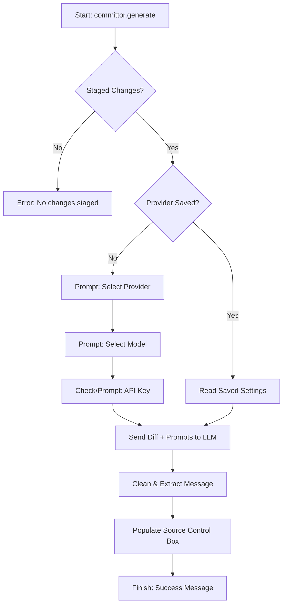
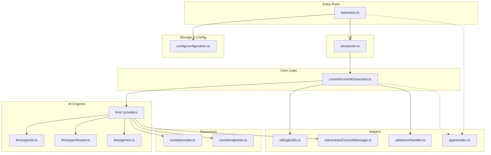

<p align="center">
  
</p>


# Committor: AI that writes your Git commits

[](https://marketplace.visualstudio.com/items?itemName=ManojBelbase.committor)
[](https://open-vsx.org/extension/manojbelbase/committor)
[](https://marketplace.visualstudio.com/items?itemName=ManojBelbase.committor)

**Committor** is a powerful VS Code extension that generates meaningful, conventional commit messages instantly from your staged changes using state-of-the-art AI models.

[**Get it on the VS Code Marketplace**](https://marketplace.visualstudio.com/items?itemName=ManojBelbase.committor) | [**Get it on Open VSX**](https://open-vsx.org/extension/manojbelbase/committor)

---

## Features

- **Auto-Population**: Automatically fills the Git Source Control input box for you.
- **Quick Access**: Dedicated **"Generate Commit"** button with a ✨ (sparkle) icon in the Source Control title bar.
- **Privacy First**: Your API keys never leave your machine.
- **Conventional Commits**: Strictly adheres to the Conventional Commits standard (`feat:`, `fix:`, `chore:`, etc.).
- **Custom Models**: Manually input any model ID supported by your provider.

---

## Getting Started

Follow these simple steps to set up and start using **Committor**.

### 1. Installation (One-time Setup)
- **VS Code Marketplace**: Search for **"Committor"** and click **Install**.
- **Configure API Key**: 
  - Stage your changes (`git add .`).
  - Press `Ctrl+Shift+P` and type **"Committor: Generate Commit Message"**.
  - Follow the prompts to select your provider (Groq, OpenRouter, Gemini, or OpenAI) and paste your API key.
  - Select **"Yes"** to save it locally for later use without reentering it every time you generate a commit message.

### 2. How to Use

#### Option A: One-Click (Recommended)
1. **Stage your changes** in the Source Control view.
2. Click the ✨ (**sparkle icon**) or the **"Generate Commit"** text in the Source Control title bar.
   - *Note: If this is your first time or if the API key is missing, a popup will guide you to select a provider and enter your key automatically.*
3. The commit message will populate the input box!

#### Option B: Command Palette
1. **Stage your changes**.
2. Press `Ctrl+Shift+P`.
3. Type **"Committor: Generate Commit Message"** and hit Enter.
   - *Note: If not configured, you will be prompted to set up your provider and API key.*

### 3. (Optional) Fine-Tuning Settings
Access settings via `Ctrl+,` and search for **"Committor"**:
- **Active Provider**: Select which AI to use.
- **Auto-Detection**: If no provider is selected, Committor automatically finds a configured API key for you.
- **Switch Provider**: Use the command palette (`Ctrl+Shift+P`) and type **"Committor: Switch AI Provider"** to quickly swap between AIs.
- **Copy to Clipboard**: Enabled by default for easy pasting elsewhere.

---

## How it Works (Flow)

The following diagram illustrates the lifecycle of a commit message generation:



---

## Folder Structure

The project is organized logically to separate concerns:

```text
committor/
├── src/
│   ├── commit/           # Core logic for commit generation
│   ├── config/           # Configuration management and key validation
│   ├── const/            # System-wide constants (prompts, endpoints)
│   ├── llms/             # Provider implementations (OpenAI, Gemini, OpenRouter)
│   ├── types/            # Centralized TypeScript interfaces
│   ├── ui/               # VS Code UI wrappers (pickers and selectors)
│   ├── utils/            # Shared utilities (Git helpers, error handlers)
│   └── extension.ts      # Main entry point and command registration
├── package.json          # Extension manifest and configuration schema
└── tsconfig.json         # TypeScript configuration
```

---

## Configuration

Settings are managed via VS Code's standard settings interface (`Ctrl+,`).

### Manual Setup via UI
1. Open **Settings** (`Ctrl+,`).
2. Type **"Committor"** in the search bar.
3. Configure your preferences:
   - **Default Provider**: Set your preferred AI.
   - **API Keys**: Manage keys for all providers.
   - **Default Models**: Choose your go-to model (Supports **o1**, **Gemini 2.5**, **DeepSeek R1**, etc.).

| Setting | Description | Default |
|---------|-------------|---------|
| `committor.activeProvider` | The AI currently in use. Auto-detected if empty. | `""` |
| `committor.openaiModel` | Default model for OpenAI. | `"gpt-4o"` |
| `committor.groqModel` | Default model for Groq. | `"openai/gpt-oss-120b"` |
| `committor.openrouterModel` | Default model for OpenRouter. | `"meta-llama/llama-3.3-70b-instruct:free"` |
| `committor.geminiModel` | Default model for Gemini. | `"gemini-1.5-flash"` |
| `committor.copyToClipboard` | Automatically copy generated message to clipboard. | `true` |

---

## Architecture Overview

The following diagram precisely maps the project's internal dependencies:



---

## Troubleshooting

### OpenRouter "Data Policy" Error
If using free models on OpenRouter, visit [OpenRouter Privacy Settings](https://openrouter.ai/settings/privacy) and enable **"Allow data usage for model improvement"**.

---

## Roadmap & Future Support

We are constantly working to improve **Committor**. Upcoming features include:

- **More LLM Providers**: Experimental support for **xAI Grok**, **Anthropic Claude**, and **Ollama** (for local models).
- **Multi-line Commits**: Support for generating detailed commit bodies and footers.
- **Internationalization**: Localized commit messages for multiple languages.
- **Custom Templates**: Allow users to define their own commit message formats.

---

## Contributing & Feedback

We welcome contributions and your feedback!
- **Request a Model**: If there’s a specific model you’d like to see supported, please [open an issue](https://github.com/ManojBelbase/committor/issues) on GitHub.
- **Contribute**: Feel free to submit pull requests for new features, bug fixes, or improved prompts.
- **Repository**: [https://github.com/ManojBelbase/committor](https://github.com/ManojBelbase/committor)

## Contact & Support

Have a suggestion, found a bug, or just want to say hi?

[**📧 Send Feedback / Report Issue**](mailto:manojbelbase56@gmail.com?subject=Committor%20Extension%20Feedback&body=Hi%20Manoj%2C%0A%0AI%20have%20some%20feedback%20for%20the%20Committor%20extension%3A%0A%0A-%20Type%3A%20%5BFeature%20Request%20%2F%20Bug%20Report%20%2F%20Question%5D%0A-%20Details%3A%20%0A%0AThanks!)

---


**Enjoying Committor?** Please rate us ⭐⭐⭐⭐⭐ in the marketplace!
