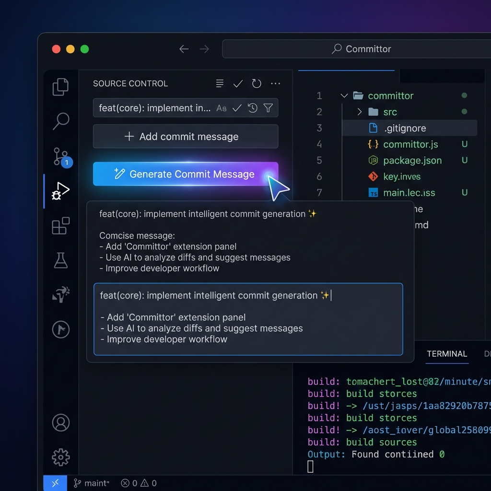
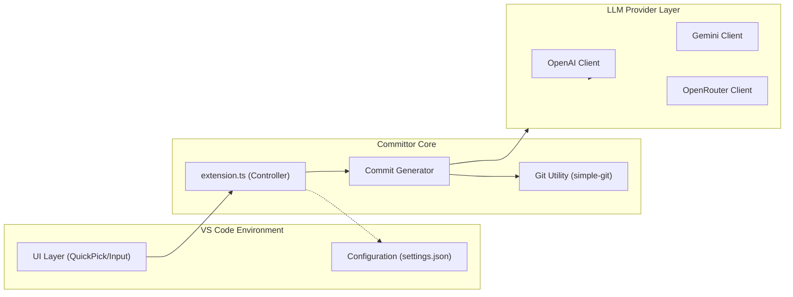
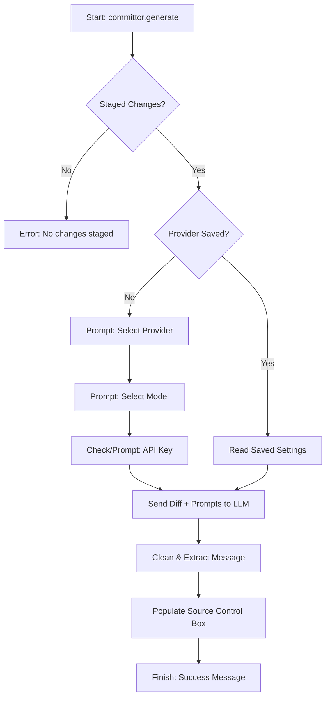

<p align="center">
  
</p>

# 🚀 Committor: AI that writes your Git commits

[](https://marketplace.visualstudio.com/items?itemName=ManojBelbase.committor)
[](https://marketplace.visualstudio.com/items?itemName=ManojBelbase.committor)

**Committor** is a powerful VS Code extension that generates meaningful, conventional commit messages instantly from your staged changes using state-of-the-art AI models.

[**Get it on the VS Code Marketplace**](https://marketplace.visualstudio.com/items?itemName=ManojBelbase.committor)



---

## 🏛️ Architecture Overview

Committor is built with a modular architecture to ensure flexibility across different AI providers while maintaining a consistent user experience.

- **Frontend (VS Code UI)**: Leverages native VS Code components like `QuickPick` and `InputBox` for provider and model selection.
- **Git Layer**: Uses `simple-git` to extract staged diffs safely from your workspace.
- **LLM Layer**: A provider-agnostic interface that routes requests to OpenAI, Google Gemini, or OpenRouter.
- **Config Recovery**: Securely manages your API keys and preferences using VS Code's `globalState` and workspace configuration.

---

## 🏢 Architecture Style

Committor follows a layered architecture pattern to maintain high decoupling between VS Code's extension API and AI provider logic.



---

## 📂 Folder Structure

The project is organized logically to separate concerns:

```text
committor/
├── src/
│   ├── commit/           # Core logic for commit generation
│   ├── config/           # Configuration management and key validation
│   ├── const/            # System-wide constants (prompts, endpoints)
│   ├── llm/              # Provider implementations (OpenAI, Gemini, OpenRouter)
│   ├── ui/               # VS Code UI wrappers (pickers and selectors)
│   ├── utils/            # Shared utilities (Git helpers, message cleaners)
│   └── extension.ts      # Main entry point and command registration
├── package.json          # Extension manifest and configuration schema
└── tsconfig.json         # TypeScript configuration
```

---

## 🚀 Installation & Setup

Using **Committor** is easy. Follow these steps to get started:

### 1. Install from Marketplace
1. Open **VS Code**.
2. Go to the **Extensions** view (`Ctrl+Shift+X`).
3. Search for **"Committor"**.
4. Click **Install**.

### 2. Configure Your API Key
1. **Stage your changes** first (`git add .`).
2. Press `Ctrl+Shift+P` (or `Cmd+Shift+P` on Mac) to open the Command Palette.
3. Type **"Committor: Generate Commit Message"** and press `Enter`.
4. Select your **AI Provider** (e.g., *OpenRouter* for free models).
5. Select your **Model** (e.g., *DeepSeek R1*).
6. When prompted, **paste your API Key**.
7. Select **"Yes"** when asked to save the key to settings for future use.

### 3. Change Settings Manually
You can update your API keys or default models anytime:
1. Open **Settings** (`Ctrl+,`).
2. Type **"Committor"** in the search bar.
3. You will see options for:
   - **Default Provider**: Skip the provider selection prompt.
   - **API Keys**: Update your keys for OpenAI, Gemini, or OpenRouter.
   - **Default Models**: Choose your preferred model for each provider.

---

## 🔄 How it Works (Flow)

The following diagram illustrates the lifecycle of a commit message generation:



## ✨ Features

- **🤖 Multi-Provider Support**: Switch between OpenAI, Google Gemini, or OpenRouter with ease.
- **🆓 Free-to-Use Models**: Optimized for free models like DeepSeek R1 and Gemini 2.0 Flash via OpenRouter.
- **⚡ Auto-Population**: Automatically fills the Git Source Control input box for you.
- **🔐 Privacy First**: Your API keys never leave your machine; they are stored locally in VS Code's secure configuration.
- **🎨 Conventional Commits**: Strictly adheres to the Conventional Commits standard (`feat:`, `fix:`, `chore:`, etc.).
- **🛠️ Custom Models**: Manually input any model ID supported by your provider.

---

## ⚙️ Configuration

Settings are managed via VS Code's standard settings interface (`Ctrl+,`).

| Setting | Description |
|---------|-------------|
| `committor.defaultProvider` | Set a default AI provider to skip selection. |
| `committor.openaiModel` | Primary OpenAI model selection. |
| `committor.openrouterModel` | Preferred OpenRouter model (default: DeepSeek R1). |
| `committor.geminiModel` | Preferred Gemini model. |

---

## ❓ Troubleshooting

### OpenRouter "Data Policy" Error
If using free models on OpenRouter, you must allow data usage for training:
1. Visit [OpenRouter Privacy Settings](https://openrouter.ai/settings/privacy).
2. Enable **"Allow data usage for model improvement"**.

---

## 👨‍💻 Contributing

We welcome contributions!
- **Repository**: [https://github.com/ManojBelbase/committor](https://github.com/ManojBelbase/committor)

---

**Enjoying Committor?** Please rate us ⭐⭐⭐⭐⭐ in the marketplace!
